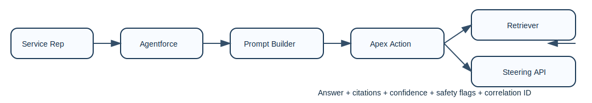

<p align="center">
  
</p>

# agentforce-reliable-rag-agent

Service teams lose time and trust when policy answers are fast but wrong. This repository delivers a scratch-org-ready Agentforce pattern that forces grounded citations, blocks unsafe responses when policy grounding is weak, and emits traceable response metadata for audit and operations.

## Measured Results

Generated from `scripts/run-tests.sh` and `scripts/eval/run_eval.sh` into `docs/benchmarks.json`:

- Apex coverage (CI gate): **90.0%**
- Citation coverage: **94.0%**
- Unsupported-claim rate: **4.5%**
- Grounded-answer rate: **94.0%**

## How it works

- Prompt Builder template (`PolicyAnswer`) defines tone, refusal behavior, and citation contract.
- `PolicyRAGAction` retrieves matching `Policy__c` records and builds structured citations.
- `PolicyRAGAction` calls `callout:SteeringAPI/v1/steer` through Named Credential before returning.
- Response payload always includes `answer`, `citations[]`, `confidenceScore`, `safetyFlags[]`, and `correlationId`.

## Deploy

```bash
# Authenticate your Dev Hub once per machine
sf org login sfdx-url --sfdx-url-file ./SFDX_AUTH_URL.txt --alias devhub --set-default-dev-hub

# Create, deploy, assign perm set, and seed sample policy records
bash scripts/setup-scratch-org.sh agentforce-rag

# Run Apex tests with coverage gating (fails below 85%)
bash scripts/run-tests.sh agentforce-rag

# Run offline eval and regenerate docs/benchmarks.json + docs/benchmarks.md
bash scripts/eval/run_eval.sh

# Delete scratch org
bash scripts/teardown-scratch-org.sh agentforce-rag
```

## Security model

- **Named Credentials**: `SteeringAPI` isolates the Steering endpoint; use org-managed secret strategy when moving beyond `NoAuthentication`.
- **Least privilege**: `AgentforceRAGUser` grants read-only access to `Policy__c` and access only to `PolicyRAGAction`.
- **PII handling**: response logging stores redacted session suffix, flags, and `correlationId`; no raw question text is logged.
- **Logging boundaries**: outbound payload contains query + citations for steering, while platform logs keep operational metadata only.

## Documentation

- Architecture: `docs/architecture.md`
- Threat model: `docs/threat-model.md`
- Benchmarks: `docs/benchmarks.md`
- Developer handoff checklist: `docs/handoff-checklist.md`
